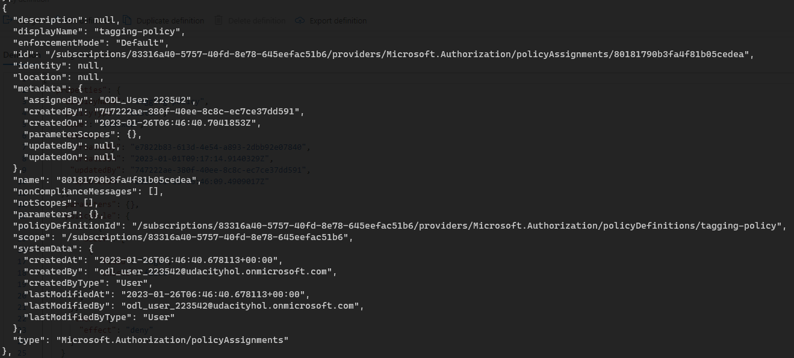
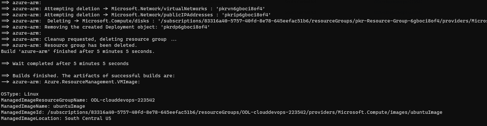
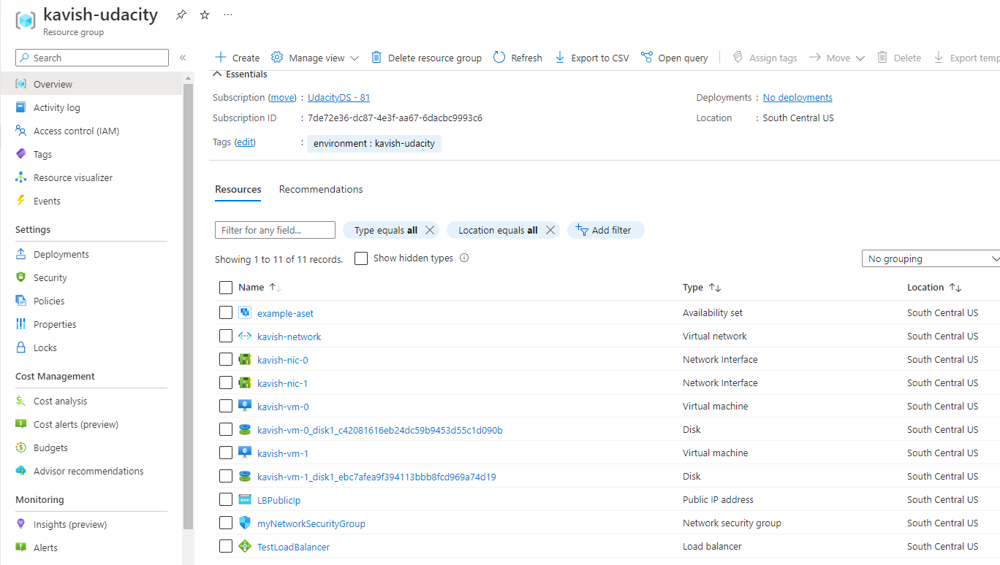
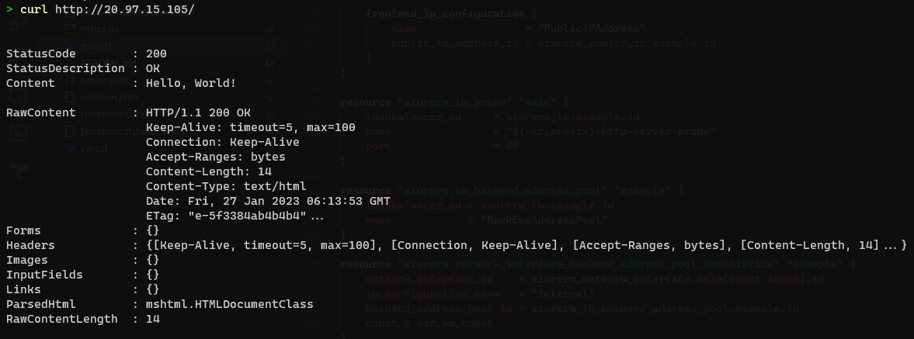

# Cloud DevOps using Microsoft Azure Nanodegree Program - Course 1 - Project
# Deploying a Web Server in Azure

## Prerequisites
- Azure Account
- Installation of latest version of Azure CLI
- Installation of latest version of Packer
- Installation of latest version of Terraform

## Instructions
### 1. Clone the repository
```
git clone https://github.com/kavish-p/udacity-azure-devops-project1.git
cd udacity-azure-devops-project1
```

### 2. Login to Azure CLI
```
az login
```

### 3. Create the policy definition to deny creation of resources that do not have tags
```
az policy definition create --name tagging-policy --rules policy.json
```

### 4. Create policy assignment
```
az policy assignment create --name tagging-policy --policy tagging-policy 
```

### 5. Check policy assignment
```
az policy assignment list
```


### 6. Create Packer image
1. Create a new resource group or use an existing one.
2. Modify `server.json` to enter your resource group name.
3. Set your environment variables for Packer to connect to Azure
```
export CLIENT_ID=""
export CLIENT_SECRET=""
export SUBSCRIPTION_ID=""
export TENANT_ID=""
```
4. Run the Packer build command
```
packer build server.json
```
5. Check output of command


### 7. Create Azure resources using Terraform
1. Initialize Terraform
```
terraform init
```

2. Make changes to _vars.tf_ if required

The variable _vm_count_ can be customized to increase or decrease the number of deployed VMs in this setup.

3. Create Terraform Plan
```
terraform plan -out solution.plan
```

4. Apply Terraform Plan
```
terraform apply solution.plan
```

5. Check Azure Resources


6. Check Deployed Web Server


7. Destroy Azure Resources
```
terraform destroy
```